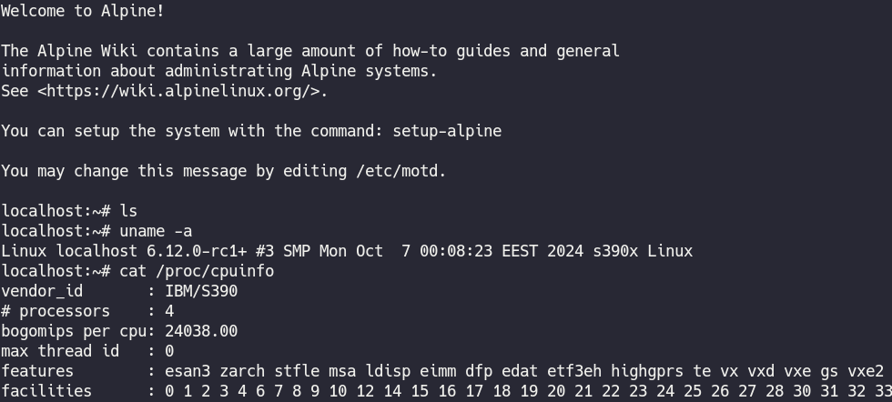

# kexec390: A Simple Tool for Kexec on s390x Architecture

**kexec390** is an automated tool designed for debugging on the s390x architecture.
It utilizes Alpine Linux netboot images for deployment, making the process easier instead writing own from scratch.

## Important Notice

> **⚠️ WARNING**
> The current Alpine Linux kernel (6.6lts) is broken for s390x systems. Please use the kernel provided in this repository.

The following parameters are tested and confirmed to work on s390x hardware (qemu works without the `-s` option):

```bash
./deploy.sh -s -k "bzImage" -i "initramfs-lts" -n
```
## Tested kexec scenarios

 - Ubuntu to Alpine: Works on qemu-s390x & native (IBM linuxone) .
 - Alpine to Alpine: does not work.

----



----

## Kernel
This repository has a pre-compiled **6.12.0-rc1** kernel.

**bzImage** has all necessary kernel options set to **=y**, ensuring that no need additional manipulations with Alpine modules or repacking of the initramfs.
This simplify the configuration.
bzImage is based on **linux-lts** configuration from alpine 3.20.
it's recommended to use only this bzImage until alpine reach 6.12 realese, because of unknown bug that prevent booting.

## Default configuration

Script uses the following default parameters for disk and network configuration:
```bash
dasd=0.0.0100 s390x_net=qeth_l2,0.0.1000,0.0.1001,0.0.1002
```
These values work for standard setups on IBM linuxone, but you can gather your hardware details using the **lshw** utility if hardware config differ.
Automatic hardware detection is not yet implemented...

## Known bug
If you're running Alpine Linux (~v6.6) on qemu-s390x with an x86_64 host, there's a known bug that prevents Alpine from booting.
This issue affects Alpine versions 3.10 through 3.20 and the Edge release.
Use the provided bzImage to avoid this.
This bug also affects real hardware, but the 6.12+git kernel seems works ok.


## Quick Start Guide
```bash
git clone https://github.com/cuzrawr/kexec390
cd kexec390
chmod +x deploy.sh
sudo ./deploy.sh <args>
```
----
Alternatively, if you prefer to run the script directly from the internet (though this is less ideal):

```bash
curl -sSL https://raw.githubusercontent.com/cuzrawr/kexec390/refs/heads/main/deploy.sh | sudo bash
```
----
For users with a native IBM s390x system, run the following command:
```bash
./deploy.sh -s -k "bzImage" -i "initramfs-lts" -n

```
----
For users running qemu-s390x, use this command instead:

```bash
./deploy.sh -k "bzImage" -i "initramfs-lts" -n
```

----
## QEMU example

For s390x Hosts:

( *use the correct CPU configuration based on your /proc/cpuinfo* ):
```bash
qemu-system-s390x -enable-kvm -m 8G -smp 4,sockets=4,cores=1,threads=1 -nographic \
-netdev user,id=vmnic,hostfwd=tcp::2223-:22 -device virtio-net-ccw,netdev=vmnic \
-hda ubuntu-24.04-server-cloudimg-s390x.img -cpu host \
-object rng-random,filename=/dev/urandom,id=rng0 -device virtio-rng-ccw,rng=rng0

```
----

For x86_64 Hosts:
```bash
qemu-system-s390x -m 8G -smp 4 -nographic \
-netdev user,id=vmnic,hostfwd=tcp::2223-:22 -device virtio-net-ccw,netdev=vmnic \
-hda ubuntu-24.04-server-cloudimg-s390x.img -cpu max \
-object rng-random,filename=/dev/urandom,id=rng0 -device virtio-rng-ccw,rng=rng0
This script has been tested on real s390x hardware and is ready for use.
```


## Happy hacking!
